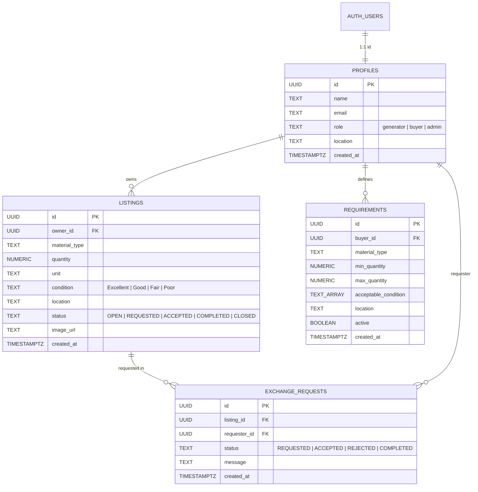

# ♻️ Smart Circular Economy & Waste Exchange Platform
## Complete Backend Handoff & Architecture Guide
### Developer 1 (Auth, Profiles, Listings, Storage, RLS) & Developer 2 / Pratush (Requirements, Matching, Requests, Dashboard, Impact)

---

### 1. Unified Database Schema Overview



---

### 2. Smart Matching Engine Architecture

The Smart Matching Engine is a **transparent, rule-based algorithm (100% weighted)** that evaluates compatibility between open waste streams and buyer demand specifications without black-box ML models.

#### Exact Weight Distribution:
$$\text{Final Match Score} = \text{Material (40\%)} + \text{Quantity (20\%)} + \text{Location (20\%)} + \text{Condition (10\%)} + \text{Availability (10\%)}$$

| Metric | Max Weight | Logic / Formula |
| :--- | :--- | :--- |
| **Material** | **40%** | Strict equality: `listing.material_type == req.material_type ? 40 : DISCARD` |
| **Quantity** | **20%** | Full 20 pts if `min <= quantity <= max`. Proportional score if within ±30% range. 0 if unsuitable. |
| **Location** | **20%** | Same industrial zone: 20 pts. Same metro district: 18–19 pts. Regional cluster: 15–16 pts. Distant: 8–10 pts. |
| **Condition** | **10%** | If `acceptable_condition.includes(listing.condition)`: 10 pts. Adjacent grade: 5 pts. Else: 0 pts. |
| **Timing/Availability** | **10%** | If `listing.status == 'OPEN' && requirement.active == true`: 10 pts. Else: 0 pts. |

#### Match Output Format:
```json
{
  "requirementId": "...",
  "buyerId": "...",
  "buyerName": "ReLoop Polymer Upcyclers",
  "matchPercentage": 99,
  "scores": {
    "materialScore": 40,
    "quantityScore": 20,
    "locationScore": 19,
    "conditionScore": 10,
    "availabilityScore": 10
  },
  "distance": "4.8 km (Same Metro District)",
  "reason": "Plastic/PET stream compatibility verified; available volume (500 kg) perfectly fits demand range (300–700 kg); condition (Good) accepted; local proximity (4.8 km (Same Metro District))."
}
```

---

### 3. Exchange Request Workflow

$$\text{OPEN} \xrightarrow{\text{Buyer Requests}} \text{REQUESTED} \xrightarrow{\text{Generator Accepts}} \text{ACCEPTED} \xrightarrow{\text{Delivery Complete}} \text{COMPLETED}$$

1. **`REQUESTED`**: Buyer creates request on an OPEN listing (`createExchangeRequest`). Listing automatically syncs to `REQUESTED`.
2. **`ACCEPTED`**: Generator reviews incoming request in Transactions Hub and clicks Accept (`acceptRequest`). Both request and listing status become `ACCEPTED`.
3. **`COMPLETED`**: Either party confirms physical batch receipt (`completeExchange`). Listing status becomes `COMPLETED`, locking the record and instantly adding the volume to the **Verified Circular Impact Hub**.
4. **`REJECTED`**: Generator declines (`rejectRequest`). If no other active requests exist, listing reverts to `OPEN`.

---

### 4. Verified Impact Calculations

* **Landfill Diversion (kg):** Exactly equals the sum of quantities from `COMPLETED` exchange listings.
* **Estimated Environmental Offsets (Configurable Multipliers with Strict Disclaimers):**
  * $\text{CO}_2\text{e Avoided} \approx \text{Total kg} \times 1.45$ kg $\text{CO}_2\text{e}$
  * $\text{Energy Conserved} \approx \text{Total kg} \times 2.75$ kWh
  * $\text{Landfill Volume Saved} \approx \text{Total kg} \times 0.0035$ $\text{m}^3$

---

### 5. Services Reference

| Service File | Methods | Purpose |
| :--- | :--- | :--- |
| [`src/services/matchingService.js`](file:///c:/Users/rohit/OneDrive/Desktop/Enigma/Enigma_Team-Rocket/src/services/matchingService.js) | `findMatchesForListing`, `findMatchesForRequirement`, `calculateMatchScore`, `generateMatchReason` | 100% weighted rule-based compatibility computation |
| [`src/services/requirementService.js`](file:///c:/Users/rohit/OneDrive/Desktop/Enigma/Enigma_Team-Rocket/src/services/requirementService.js) | `createRequirement`, `getRequirements`, `getMyRequirements`, `updateRequirement`, `deleteRequirement` | Buyer material demand management |
| [`src/services/exchangeRequestService.js`](file:///c:/Users/rohit/OneDrive/Desktop/Enigma/Enigma_Team-Rocket/src/services/exchangeRequestService.js) | `createExchangeRequest`, `getRequestsForOwner`, `getRequestsForUser`, `acceptRequest`, `rejectRequest`, `completeExchange` | Multi-party circular exchange transaction lifecycle |
| [`src/services/impactService.js`](file:///c:/Users/rohit/OneDrive/Desktop/Enigma/Enigma_Team-Rocket/src/services/impactService.js) | `getImpactMetrics` | Circular material & landfill diversion aggregation |
| [`src/services/dashboardService.js`](file:///c:/Users/rohit/OneDrive/Desktop/Enigma/Enigma_Team-Rocket/src/services/dashboardService.js) | `getDashboardMetrics` | Global & personalized user metrics |
| [`src/services/listingService.js`](file:///c:/Users/rohit/OneDrive/Desktop/Enigma/Enigma_Team-Rocket/src/services/listingService.js) | `createListing`, `getListings`, `getListingById`, `updateListing`, `deleteListing`, `filterListings` | Waste material listings CRUD & filtering |
| [`src/services/authService.js`](file:///c:/Users/rohit/OneDrive/Desktop/Enigma/Enigma_Team-Rocket/src/services/authService.js) | `register`, `login`, `logout`, `getCurrentUser`, `getSession` | Supabase Authentication & session handling |
| [`src/services/storageService.js`](file:///c:/Users/rohit/OneDrive/Desktop/Enigma/Enigma_Team-Rocket/src/services/storageService.js) | `uploadListingImage`, `deleteListingImage` | Supabase Storage image management |

---

### 6. SQL Migrations & One-Click Scripts

1. Unified Schema: [`supabase/schema.sql`](file:///c:/Users/rohit/OneDrive/Desktop/Enigma/Enigma_Team-Rocket/supabase/schema.sql)
2. Versioned Migration 01 (Foundation): [`supabase/migrations/20260926_01_init_schema.sql`](file:///c:/Users/rohit/OneDrive/Desktop/Enigma/Enigma_Team-Rocket/supabase/migrations/20260926_01_init_schema.sql)
3. Versioned Migration 02 (Matching & Demands): [`supabase/migrations/20260926_02_buyer_matching_schema.sql`](file:///c:/Users/rohit/OneDrive/Desktop/Enigma/Enigma_Team-Rocket/supabase/migrations/20260926_02_buyer_matching_schema.sql)
4. Comprehensive Seed Data: [`supabase/seed.sql`](file:///c:/Users/rohit/OneDrive/Desktop/Enigma/Enigma_Team-Rocket/supabase/seed.sql)
